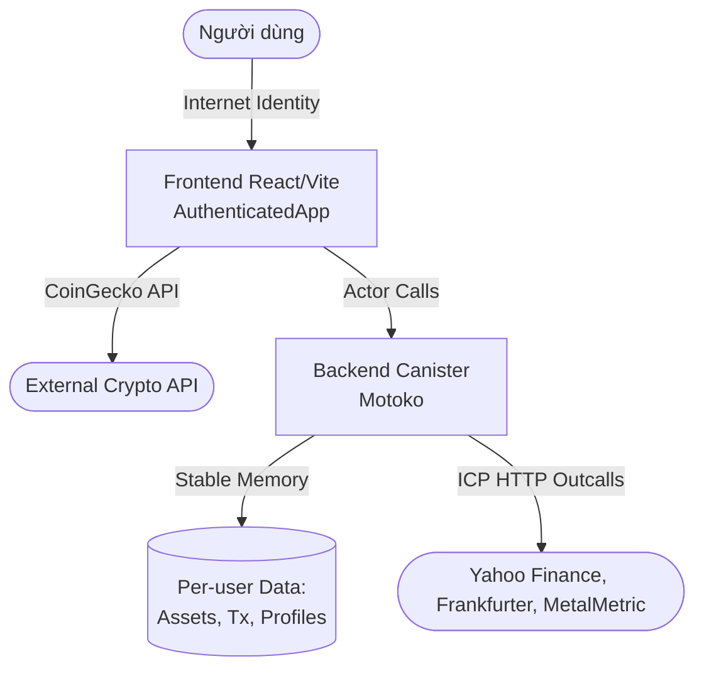

# Miinsolio

> **Miinsolio** là một ứng dụng **theo dõi danh mục đầu tư cá nhân (portfolio tracker)** được xây dựng hoàn toàn trên nền tảng **Internet Computer Protocol (ICP)**. Hệ thống hoạt động hoàn toàn phi tập trung (100% on-chain) qua các ICP canisters, không phụ thuộc vào máy chủ hoặc cơ sở dữ liệu truyền thống.

---

## 📑 Mục lục
- [Tech Stack](#-tech-stack)
- [Bắt đầu (Getting Started)](#-bắt-đầu-getting-started)
- [Triển khai (Deployment)](#-triển-khai-deployment)
- [Tài liệu Kỹ thuật (Technical Specs)](#-tài-liệu-kỹ-thuật)
  - [Kiến trúc hệ thống](#1-kiến-trúc-hệ-thống)
  - [Data Models](#2-data-models)
  - [API & HTTP Outcalls](#3-backend-api--http-outcalls)
- [Cấu trúc thư mục](#-cấu-trúc-thư-mục)

---

## 💻 Tech Stack

### Frontend
- **Framework**: React 19 + Vite
- **Ngôn ngữ**: TypeScript
- **Styling**: TailwindCSS v3 + shadcn/ui
- **State & Routing**: TanStack Query (React Query v5) + TanStack Router
- **Khác**: Framer Motion (Animation), Recharts (Charts), i18next (Đa ngôn ngữ)
- **ICP Auth**: `@dfinity/auth-client`, `@dfinity/identity` (Internet Identity)

### Backend
- **Ngôn ngữ**: Motoko (Smart contract language của ICP)
- **Package Manager**: `mops` (Sử dụng compiler `moc` v1.3.0)
- **Infrastructure**: HTTP Outcalls (Fetch Data), Canister Stable Memory.
- **Packages**: `core@2.2.0`, `caffeineai-http-outcalls`, `caffeineai-authorization`

---

## 🚀 Bắt đầu (Getting Started)

### Yêu cầu hệ thống (Prerequisites)
- [Node.js](https://nodejs.org/en/) & [pnpm](https://pnpm.io/installation)
- [DFX SDK](https://internetcomputer.org/docs/current/developer-docs/getting-started/install/) (để chạy local replica và deploy ICP).
- [Mops](https://j4mgo-iqaaa-aaaap-qbzqq-cai.icp0.io/) (Motoko package manager).

### Cài đặt môi trường Local 
Để kiểm thử ứng dụng hoàn chỉnh ở môi trường local (gồm Backend Canister và Frontend Dev Server):

1. **Khởi động local network (replica)**:
   ```bash
   dfx start --clean --background
   ```
2. **Triển khai Internet Identity và Backend**:
   ```bash
   cd src/backend && mops install && cd ../..
   dfx deploy internet_identity
   dfx deploy backend
   ```
3. **Tạo Frontend bindings**:
   (Update TypeScript type definitions từ code Motoko của backend)
   ```bash
   pnpm bindgen
   ```
4. **Chạy Frontend (Dev server)**:
   ```bash
   cd src/frontend
   pnpm install
   pnpm dev
   ```
   > Truy cập `http://localhost:5173`. Việc đăng nhập bằng Internet Identity sẽ sử dụng local provider hoàn toàn tự động.

---

## ☁️ Triển khai (Deployment)

### Môi trường ICP Mainnet (Production)
1. **Chuẩn bị Identity & Cycles**:
   - Chắc chắn identity/wallet đang chọn (`dfx identity list`) có quyền deploy và đủ Cycles.
2. **Deploy lên IC**:
   ```bash
   # Cài đặt toàn bộ các thư viện trước khi build
   cd src/backend && mops install
   cd ../frontend && pnpm install && pnpm build
   cd ../..
   
   # Tự động build và deploy backend + frontend
   dfx deploy --network ic
   ```
3. **HTTP Outcalls**: Canister bắt buộc phải có đủ Cycles dồi dào để trả phí gửi request HTTP ra ngoài (fetch giá từ các API bên thứ 3).

### Cấu hình Custom Domain (Vd: `app.miinsolio.com`)

1. **Cấu hình chứng thực (.well-known)**:
   Tạo file văn bản không đuôi tại `src/frontend/public/.well-known/ic-domains` và dòng text duy nhất là tên miền của bạn (ví dụ: `app.miinsolio.com`). Vite sẽ tự copy thư mục này vào asset build (`dist`).
2. **DNS Record**:
   - Trỏ `CNAME` từ `app.miinsolio.com` tới `<frontend-canister-id>.icp2.io`.
   - Trỏ `CNAME` cho xác thực ACME: `_acme-challenge.app.miinsolio.com` tới `_acme-challenge.<frontend-canister-id>.icp2.io`.
3. **Redeploy**: Chờ DNS update xong, chạy `dfx deploy frontend --network ic`. IC Boundary Nodes sẽ tự cập nhật cấu hình và cấp phát free SSL tự động cho custom domain.

---

## 📐 Tài liệu Kỹ thuật

### 1. Kiến trúc hệ thống


### 2. Định dạng dữ liệu (Data Models)
Tất cả map dựa theo định danh người dùng (`Principal`):
- **Asset**: `symbol`, `name`, `category` (Stock|Crypto|Forex|Cash...), `currency`, `manualPrice`.
- **Transaction**: `txType` (Buy|Sell|Deposit|Withdraw), `quantity`, `price`, `fee`, `date`.
- **Holdings (Tính toán runtime)**: Tính tự động theo FIFO từ Txs. Lãi/lỗ dựa vào `totalCost` và `manualPrice`.

> ⚠️ **Lưu ý Quan trọng**: `currentPrice` trong Holdings được lấy từ `asset.manualPrice` (lưu trữ off-chain trong Database), KHÔNG lấy trực tiếp từ API tại thời điểm fetch. Frontend cần update `manualPrice` về Backend định kì để đồng bộ Lãi/Lỗ.

### 3. Backend API & HTTP Outcalls
Các logic gọi ra HTTP Outcall (phải có hàm `transform` để chuẩn hoá Payload cho IC Node Consensus):
- `getStockPrice(symbol)` / `searchStocks(term)`: Lấy dữ liệu qua Yahoo Finance (v8 / v1).
- `getExchangeRates()`: Rate ngoại tệ Frankfurt (Cache 30 phút).
- `getMetalPriceBySymbol(symbol)`: Giá Gold/Silver... từ MetalMetric (Cache 5 phút).
- Crypto Data: Để giảm tải Outcall fees, frontend gọi TRỰC TIẾP đến `CoinGecko v3` từ browser.

---

## 📁 Cấu trúc thư mục

```text
miinsolio/
├── src/
│   ├── backend/
│   │   ├── main.mo               # Smart contract logic lõi (~1500 dòng)
│   │   ├── mops.toml             # Backend packages
│   │   └── vendor/               # Motoko vendor (Outcall & Auth mixins)
│   └── frontend/
│       ├── src/
│       │   ├── App.tsx           
│       │   ├── backend.d.ts      # TypeScript interfaces từ Candid
│       │   ├── components/       # Component hiển thị (UI, search, charts)
│       │   ├── contexts/         # React Contexts (PriceFeed, Theme)
│       │   ├── hooks/            # TanStack query handlers & hooks
│       │   └── pages/            # Page routing components
│       └── package.json
├── dfx.json                      # Cấu hình Canisters của dự án dành cho DFX SDK
└── AGENTS.md                     # Ghi chú hướng dẫn cho AI Agents
```

---
*Dự án dựa trên kiến trúc mẫu xuất phát từ Caffeine AI Framework.*
